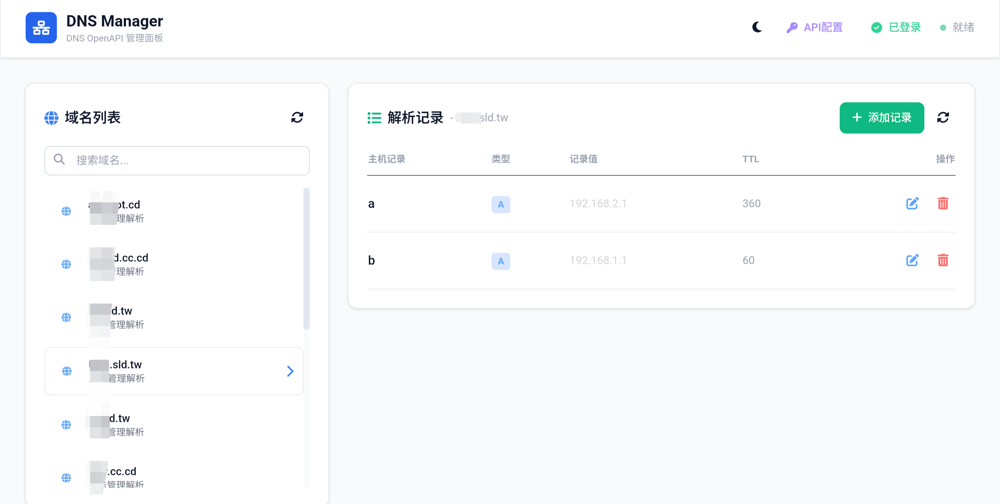

# DNS Manager（AI编写）

一个基于 EdgeOne Pages 部署的 DNS 记录管理面板，支持 **VPS8** 和 **DNSHE** 双平台，方便将不能托管到 Cloudflare 的免费域名进行集中管理。

## EdgeOne Pages 部署

## 功能特性

- 🔐 **访问密码保护** — 支持通过环境变量配置访问密码，未配置时无需验证
- 🌐 **DNS 解析管理** — 查看、添加、编辑、删除域名解析记录
- 🔄 **双平台支持** — 一键切换 VPS8 和 DNSHE 平台
- 👤 **多账号管理** — 支持配置多个 API 账号，快速切换
- 🎨 **深色/浅色主题** — 支持一键切换主题，偏好自动保存
- 📱 **响应式设计** — 适配桌面端和移动端
- 🔑 **API Key 配置** — 支持服务端环境变量或前端手动输入
- ⚡ **Edge Function 代理** — 自动处理 CORS，无需额外配置
- 🛡️ **安全加固** — XSS 防护、事件委托、输入转义、Secure Cookie

## 页面预览



## 项目结构

```
.
├── edge-functions/
│   ├── api/
│   │   ├── auth/
│   │   │   └── verify.js          # 登录验证接口（速率限制 + KV Session）
│   │   └── client/
│   │       └── dnsopenapi/
│   │           └── [[default]].js  # DNS API 代理（双平台）
│   └── index.js                   # 入口重定向
├── public/
│   └── index.html                 # 前端管理面板
└── edgeone.json                   # EdgeOne Pages 配置
```

## 快速部署

### 1. 创建 EdgeOne Pages 项目

1. 登录 [EdgeOne Pages 控制台](https://console.cloud.tencent.com/edgeone/pages)
2. 创建新项目，选择「从模板创建」或「从 Git 导入」
3. 上传本项目代码

### 2. 配置环境变量

在 EdgeOne Pages 控制台 → 项目设置 → 环境变量中配置：

| 变量名 | 必填 | 说明 |
|--------|------|------|
| `ACCESS_PASSWORD` | 可选 | 访问密码，不配置则无需登录 |
| `DNS_API_KEY` | 可选 | VPS8 DNS OpenAPI 密钥。支持单字符串或 JSON 数组格式，如 `[{"name":"账号A","key":"xxx"}]` |
| `DNS_API_BASE` | 可选 | VPS8 API 基础地址，默认 `vps8.zz.cd` |
| `DNSHE_API_KEY` | 可选 | DNSHE API Key。支持单字符串或 JSON 数组格式 |
| `DNSHE_API_SECRET` | 可选 | DNSHE API Secret。支持单字符串或 JSON 数组格式 |
| `DNSHE_API_BASE` | 可选 | DNSHE API 地址，默认 `https://api005.dnshe.com/index.php` |

### 3. 绑定 KV 命名空间（推荐）

1. 在 EdgeOne 控制台创建 KV 命名空间
2. 在 Pages 项目设置中绑定 KV，**变量名称**填写 `dns_kv`
3. 绑定后 session 将持久化存储，更安全可靠

> **注意**：若不绑定 KV，系统会通过 token 时间戳进行本地验证（24小时有效），但安全性较低。

### 4. 部署

点击「部署」按钮，等待构建完成即可访问。

## 使用说明

### 访问面板

部署完成后，访问分配的域名即可进入管理面板。

### 平台切换

- 点击顶部 **VPS8 / DNSHE** 切换按钮选择目标平台
- 切换后域名列表和解析记录会自动刷新

### 登录验证

- 如果配置了 `ACCESS_PASSWORD`，点击右上角「登录」按钮输入密码
- 验证成功后，右上角显示「已登录」状态
- 登录状态通过 **Cookie + localStorage 双标记** 保持，刷新页面后自动恢复
- 点击「已登录」按钮可退出登录

### API 配置

- 点击右上角「API配置」按钮
- 如果服务端已配置 API Key，会显示「服务端已配置」标签
- 也可手动输入 API Key 覆盖服务端配置
- 支持 JSON 数组格式配置多账号

### 管理解析记录

1. **选择域名** — 左侧域名列表点击选择
2. **查看记录** — 右侧显示该域名下所有解析记录
3. **添加记录** — 点击「添加记录」按钮，填写主机记录、类型、记录值等信息
4. **编辑记录** — 点击记录行右侧的编辑图标
5. **删除记录** — 点击记录行右侧的删除图标，确认后删除

## 技术细节

### 认证机制

```
登录流程：
1. 用户输入密码 → POST /api/auth/verify
2. 服务端验证密码 → 生成 token → 写入 KV（如有）
3. 返回 Set-Cookie: dns_session=token
4. 前端同时写入 localStorage: dns_auth = true
5. 后续请求携带 Cookie，服务端验证 KV 或时间戳
6. 退出时同时清除 Cookie 和 localStorage
```

### Cookie 说明

- **名称**: `dns_session`
- **有效期**: 24 小时
- **Path**: `/`
- **SameSite**: `Lax`
- **Secure**: `true`（HTTPS 环境）
- **HttpOnly**: `false`（前端需要读取以更新 UI 状态）

### 主题切换

主题偏好保存在 `localStorage`，键名为 `theme`，值为 `dark` 或 `light`。

## 安全特性

| 防护措施 | 说明 |
|----------|------|
| XSS 防护 | 所有用户输入通过 `escapeHtml()` 转义，事件委托替代内联 `onclick` |
| 路径遍历 | Edge Function 拦截 `../` 非法路径 |
| 速率限制 | 登录接口 1 分钟最多 5 次请求 |
| 统一错误 | 认证失败返回统一消息，不泄露配置状态 |
| Secure Cookie | Cookie 设置 Secure + SameSite=Lax |
| CORS 代理 | 通过 Edge Function 代理 API 请求，避免暴露密钥 |

## 常见问题

### Q: 刷新页面后登录状态丢失？

A: 请检查：
1. `verify.js` 中 `Set-Cookie` 是否包含 `SameSite=Lax`
2. Cookie 的 `Path` 是否为 `/`
3. 浏览器是否禁用了第三方 Cookie

### Q: KV 中没有 session 数据？

A: 请检查：
1. KV 命名空间是否正确绑定，**变量名称**必须为 `dns_kv`
2. 代码中使用的是 `dns_kv.put()` 而非 `env.dns_kv.put()`
3. EdgeOne Pages 的 KV 绑定方式与 Cloudflare Workers 不同，直接通过变量名调用

### Q: 域名列表加载失败？

A: 请检查：
1. `DNS_API_KEY` 是否正确配置
2. `DNS_API_BASE` 是否正确
3. 浏览器控制台查看具体错误信息

### Q: 如何取消密码保护？

A: 删除 `ACCESS_PASSWORD` 环境变量，或将其设为空值，重启后无需登录即可访问。

### Q: 如何配置多个 API 账号？

A: 将环境变量设为 JSON 数组格式：
```json
[{"name":"账号A","key":"xxx"},{"name":"账号B","key":"yyy"}]
```
部署后顶部会显示账号切换芯片，点击即可切换不同账号。

如果只配置单个账号，直接填写密钥字符串即可，无需 JSON 格式。

VPS8（2个账号）  
DNS_API_KEY = [{"name":"账号a","key":"a-key"},{"name":"账号b","key":"b-key"}]  
  
DNSHE（2个账号）  
DNSHE_API_KEY = [{"name":"账号c","key":"c-key"},{"name":"账号d","key":"d-key"}]  
DNSHE_API_SECRET = [{"name":"账号c","key":"c-SECRET"},{"name":"账号d","key":"d-SECRET"}]   

完整配置
| 变量名                | 值                                                                   |
| ------------------ | ------------------------------------------------------------------- |
| `ACCESS_PASSWORD`  | `your-access-password`                                              |
| `DNS_API_KEY`      | `[{"name":"账号a","key":"a-key"},{"name":"账号b","key":"b-key"}]`       |
| `DNS_API_BASE`     | `vps8.zz.cd`                                                        |
| `DNSHE_API_KEY`    | `[{"name":"账号c","key":"c-key"},{"name":"账号d","key":"d-key"}]`       |
| `DNSHE_API_SECRET` | `[{"name":"账号c","key":"c-SECRET"},{"name":"账号d","key":"d-SECRET"}]` |
| `DNSHE_API_BASE`   | `https://api005.dnshe.com/index.php`                                |


## 安全建议

1. **务必配置 `ACCESS_PASSWORD`**，防止未授权访问
2. **建议绑定 KV 命名空间**，避免使用纯时间戳验证
3. **定期更换 API Key**，并在服务端配置而非前端输入
4. **使用 HTTPS**，EdgeOne Pages 默认启用
5. **生产环境移除 Edge Function 中的 console.log**

## 技术栈

- [EdgeOne Pages](https://cloud.tencent.com/product/edgeone) — 边缘计算托管平台
- [Tailwind CSS](https://tailwindcss.com/) — 原子化 CSS 框架
- [Font Awesome](https://fontawesome.com/) — 图标库
- VPS8 / DNSHE OpenAPI — 域名解析接口

## License

MIT
